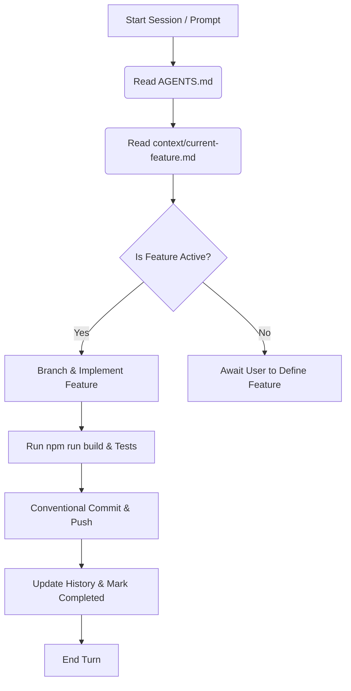

# 📱 Socials Ark — Social Media PM SaaS

Socials Ark is a comprehensive project and content management platform built for social media teams, creators, and digital marketing agencies. It serves as a unified workspace to plan, draft, review, approve, and track the financial performance of content across multiple clients and platforms.

---

## 📌 Core Features

- **Workspaces & Roles**: Multi-tenant workspaces representing agencies with granular permissions (Owner, Editor, Client).
- **Clients & Campaign Management**: Organizes clients under workspaces and groups projects/campaigns per client.
- **Social Pages**: Direct platform-to-page mappings (Instagram, TikTok, Facebook, X, LinkedIn) for accurate publishing schedules.
- **Content Workflow**: Real-time calendar/kanban board (Idea ➔ Draft ➔ Internal Review ➔ Client Review ➔ Approved ➔ Scheduled ➔ Published), live comments, and a passwordless client-facing approval dashboard.
- **Financial Tracking (per Page)**: Pure integer cents-based transactions (retainers, sponsorship income, freelancer fees, ad spend), monthly recurring expenses, and automated P&L summaries rolled up to the client and workspace levels.
- **Media Library**: Shared asset storage for multi-platform media reuse.

---

## 🧱 Tech Stack

- **Framework**: [Next.js 15 (App Router)](https://nextjs.org/) + React 19
- **Database & Backend**: [Convex](https://www.convex.dev/) (real-time queries, mutations, scheduled functions, and cloud file storage)
- **Authentication**: [Clerk](https://clerk.com/)
- **UI & Styling**: [shadcn/ui](https://ui.shadcn.com/) + Tailwind CSS
- **AI Agent**: Google Antigravity CLI (`agy`)

---

## ⚙️ Setup & Operation

### 1. Installation
Clone the repository and install dependencies:
```bash
npm install
```

### 2. Environment Configuration
Create a `.env.local` file in the root of the project and add the necessary environment variables for Clerk and Convex:
```env
# Convex
CONVEX_DEPLOYMENT=...
NEXT_PUBLIC_CONVEX_URL=...

# Clerk Auth
NEXT_PUBLIC_CLERK_PUBLISHABLE_KEY=...
CLERK_SECRET_KEY=...
```

### 3. Local Development
To run the application locally, you need to spin up the local development servers for both Next.js and Convex.

- **Start the Next.js development server**:
  ```bash
  npm run dev
  ```
- **Start the Convex local development backend**:
  ```bash
  npx convex dev
  ```

### 4. Build & Production Validation
To compile the codebase and run strict TypeScript/linting checks:
```bash
npm run build
```

---

## 🤖 AI Workflow & Agent Coordination

This codebase is specifically optimized for pair-programming with AI agents (like **Antigravity**). It implements a **Context-First Architecture** that guides how the AI reads state, follows guidelines, and writes code.



### 1. Root Coordination File: `AGENTS.md`
The agent entry point is the root [AGENTS.md](file:///C:/Noa%20Files/myProjects/socials-ark/AGENTS.md) file. This file is automatically loaded by the AI on every prompt. It prevents cognitive overload by pointing the agent to relevant files on demand instead of forcing it to scan the entire repository.

### 2. Context Directory structure: `/context`
All project specifications, guidelines, and feature scopes are maintained inside the [context/](file:///C:/Noa%20Files/myProjects/socials-ark/context/) directory:
- [project-overview.md](file:///C:/Noa%20Files/myProjects/socials-ark/context/project-overview.md) — The single source of truth for problem definitions, specifications, and data schemas.
- [coding-standards.md](file:///C:/Noa%20Files/myProjects/socials-ark/context/coding-standards.md) — Strict guidelines for languages, database conventions, React Server/Client boundaries, styling, and naming rules.
- [ai-interaction.md](file:///C:/Noa%20Files/myProjects/socials-ark/context/ai-interaction.md) — Guardrails for AI agent communication, git branching, commit guidelines, and resolving problems.
- [current-feature.md](file:///C:/Noa%20Files/myProjects/socials-ark/context/current-feature.md) — A living document detailing the active task, goals, notes, and incremental history.

### 3. Step-by-Step AI Feature Cycle
When starting a task, the AI agent must adhere to the following sequence:
1. **Understand & Align**: Read [current-feature.md](file:///C:/Noa%20Files/myProjects/socials-ark/context/current-feature.md) to inspect the feature name, status, goals, and history.
2. **Branch**: Create a feature or fix branch from `main` (e.g. `feature/workspace-creation` or `fix/p&l-calculations`).
3. **Implement**: Write code targeting only the scope of the feature.
4. **Compile & Verify**: Run `npm run build` and resolve any compilation or linting issues first.
5. **Commit**: Seek permission, then commit changes using Conventional Commits.
6. **Push & Track**: Push changes to the remote branch and establish tracking.
7. **Document completion**: Update the History in [current-feature.md](file:///C:/Noa%20Files/myProjects/socials-ark/context/current-feature.md), reset status to `Completed` (or `Not Started` for next steps).

---

## 🚫 Non-Negotiables for Development
- **No Float Currency**: Financial calculations must always handle values as integer cents (e.g., `100` cents = `$1.00`). Never use float storage or `parseFloat` for pricing fields.
- **Database Indexes**: Every table in [schema.ts](file:///C:/Noa%20Files/myProjects/socials-ark/convex/schema.ts) must be configured with a `.index()` correlating with active queries. Unindexed `.filter()` calls are forbidden.
- **Client Route Security**: Public-facing views (e.g., `/share/[token]`) must never depend on authenticated sessions (i.e. Clerk auth checks).
