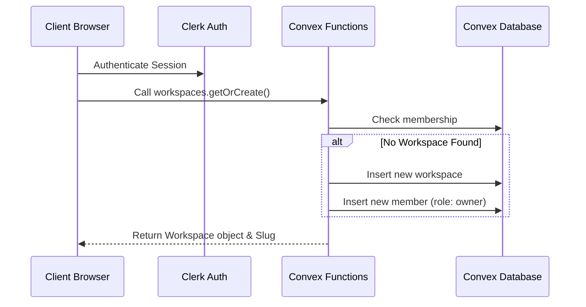
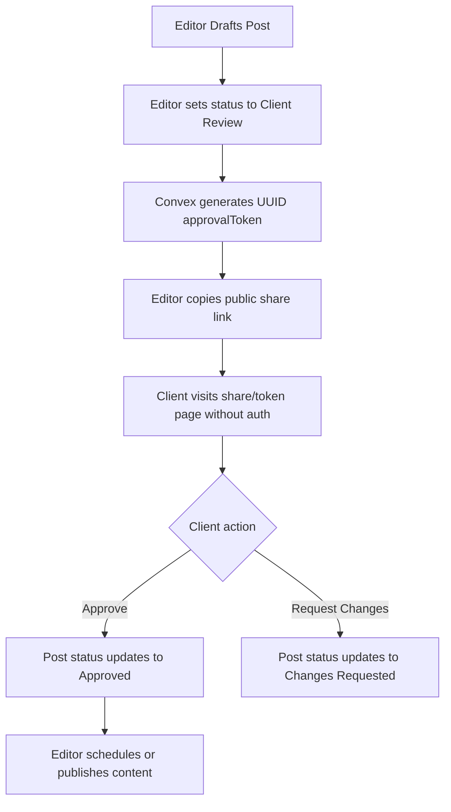

# Socials Ark — Features & Flows Documentation

This document serves as the central technical reference for all features implemented in the Socials Ark platform. Refer to this document when onboarding, reviewing existing architecture, or planning extensions.

---

## 🔑 1. Workspaces & Authentication
### Overview
Manages authenticated agency workspaces and user access control using Clerk (identity provider) and Convex (database & mutations logic).

### Key Files
* **Auth Provider & Sync**: [ConvexClientProvider.tsx](file:///c:/Noa%20Files/myProjects/socials-ark/components/ConvexClientProvider.tsx)
* **Backend Queries & Verification**: [workspaces.ts](file:///c:/Noa%20Files/myProjects/socials-ark/convex/workspaces.ts)
* **Access Rules & Layout**: [layout.tsx](file:///c:/Noa%20Files/myProjects/socials-ark/app/%28dashboard%29/%5BworkspaceSlug%5D/layout.tsx)

### User Flow
1. User logs in/registers via **Clerk**.
2. Upon redirecting to `/`, the root component triggers `getOrCreate` in [workspaces.ts](file:///c:/Noa%20Files/myProjects/socials-ark/convex/workspaces.ts).
3. If no workspace exists for the user, one is auto-generated (e.g. `"Noa's Workspace"`) and the user is set as the workspace `owner`.
4. User is redirected to their default workspace path `/[workspaceSlug]/dashboard`.

### Technical Architecture


---

## 📁 2. Clients, Campaigns, & Social Pages
### Overview
Provides organizing boundaries. A Workspace has many **Clients**, each Client has many **Campaigns/Projects**, and each Client has many connected **Social Pages** (handles on Facebook, Instagram, LinkedIn, X, TikTok).

### Key Files
* **Database Schema**: [schema.ts](file:///c:/Noa%20Files/myProjects/socials-ark/convex/schema.ts) (`clients`, `projects`, `socialPages` tables)
* **Client Pages Frontend**: [page.tsx](file:///c:/Noa%20Files/myProjects/socials-ark/app/%28dashboard%29/%5BworkspaceSlug%5D/clients/page.tsx)
* **Backend Operations**: [clients.ts](file:///c:/Noa%20Files/myProjects/socials-ark/convex/clients.ts), [projects.ts](file:///c:/Noa%20Files/myProjects/socials-ark/convex/projects.ts), [socialPages.ts](file:///c:/Noa%20Files/myProjects/socials-ark/convex/socialPages.ts)

### User Flow
1. Navigate to **Clients & Pages**.
2. Click **Add Client** to insert a new client company profile.
3. Select the Client card to view, add, or toggle campaigns/projects.
4. Click **Connect Channel** to link specific platform handles for that client.

---

## 📋 3. Tasks Board & Assistant Workload Tracker
### Overview
Offers an operational Kanban task board for internal agency tasks (such as client asset acquisition, feedback collection, setup operations) alongside an Assistant Workload Tracker detailing operational tasks assigned to team members.

### Key Files
* **Tasks Frontend**: [page.tsx](file:///c:/Noa%20Files/myProjects/socials-ark/app/%28dashboard%29/%5BworkspaceSlug%5D/tasks/page.tsx)
* **Backend Logic**: [tasks.ts](file:///c:/Noa%20Files/myProjects/socials-ark/convex/tasks.ts)

### Spacing & Drag-and-Drop Implementation
* **Columns Layout**: Employs a non-squeezing horizontal scroll flex row (`flex gap-5 overflow-x-auto w-full`). Every column is configured with a fixed width (`w-[290px] shrink-0`).
* **HTML5 Native Drag-and-Drop**:
  * Task cards are configured as `draggable`. Grabbing a card reduces opacity to `40%`, applies a dashed border, and downscales it to `95%` to form a ghost card preview.
  * Columns act as drop zones (`onDragOver`, `onDragEnter`, `onDragLeave`, `onDrop`).
  * Hovering a card over a column shifts its border to a custom Indigo gradient glow.
  * Dropping triggers the `updateTaskStatus` Convex mutation and fires a success toast.

---

## 🎨 4. Content Workflow
### Overview
The central content pipeline containing both a Trello-style Kanban planning board and an interactive Month Content Calendar. Enables caption drafting, assignee mapping, page targeting, and client approvals.

### Key Files
* **Content Frontend**: [page.tsx](file:///c:/Noa%20Files/myProjects/socials-ark/app/%28dashboard%29/%5BworkspaceSlug%5D/content/page.tsx)
* **Backend Logic**: [posts.ts](file:///c:/Noa%20Files/myProjects/socials-ark/convex/posts.ts)
* **Public Client Approval Route**: [page.tsx](file:///c:/Noa%20Files/myProjects/socials-ark/app/share/%5Btoken%5D/page.tsx)

### Client Approval Loop


### Spacing & Drag-and-Drop
* Same fixed-width scroll flex column structure (`w-[290px] shrink-0`) as the Tasks board.
* Native HTML5 drag-and-drop triggers `updatePostStatus` on drop.

---

## ⚙️ 5. Workspace Customization Settings
### Overview
Gives users absolute flexibility over their workflow by enabling them to dynamically add, rename, recolor, show/hide, or permanently delete columns for both Tasks and Posts boards.

### Key Files
* **Settings Page**: [page.tsx](file:///c:/Noa%20Files/myProjects/socials-ark/app/%28dashboard%29/%5BworkspaceSlug%5D/settings/page.tsx)
* **Workspace Settings Mutation**: [updateSettings](file:///c:/Noa%20Files/myProjects/socials-ark/convex/workspaces.ts#L184-L234)

### Columns Schema & Saving Flow
* Active configurations are saved inside the `workspaces` table under `settings: { taskColumns: [...], postColumns: [...] }`.
* Status validation has been relaxed from rigid literal unions to `v.string()` across `posts.status` and `tasks.status` in the database to accommodate user-defined column IDs (e.g. `task_backlog_a1b2`).
* When loaded, the Kanban boards fall back to standard defaults if `workspace.settings` is unconfigured.

---

## 👥 6. Workspace Members & Invitations
### Overview
Secures multi-user access control. Owners can invite assistants and editors to join their workspace via a secure invitation token system.

### Key Files
* **Team Page**: [page.tsx](file:///c:/Noa%20Files/myProjects/socials-ark/app/%28dashboard%29/%5BworkspaceSlug%5D/team/page.tsx)
* **Invitation Backend**: [invitations.ts](file:///c:/Noa%20Files/myProjects/socials-ark/convex/invitations.ts)
* **Public Invitation Accept Route**: [page.tsx](file:///c:/Noa%20Files/myProjects/socials-ark/app/invite/%5Btoken%5D/page.tsx)

### User Flow
1. Owner goes to **Team Members** page and inserts an email to generate an invitation link.
2. Link contains a secure token (`/invite/token`).
3. Teammate logs in via Clerk, visits the URL, and accepts the invitation.
4. Convex checks token validity, consumes it, and inserts the user into the `members` list.

---

## 💰 7. Finance Ledger & P&L Summaries
### Overview
Tracks agency income ( retainers, sponsors, affiliates) and production expenses ( freelancer pay, tools, ad spend) mapped to clients, campaigns, and social media handles. 

### Key Files
* **Financial Ledger page**: [page.tsx](file:///c:/Noa%20Files/myProjects/socials-ark/app/%28dashboard%29/%5BworkspaceSlug%5D/finance/page.tsx) (Accessible based on plan tiers)
* **Transactions Backend**: [transactions.ts](file:///c:/Noa%20Files/myProjects/socials-ark/convex/transactions.ts)

### Design & Coding Standard
* **Currency Rule**: All financial amounts are strict integers representing cents (e.g. `$100.50` is stored as `10050` in database) to prevent floating-point rounding errors.
* **Rollups**: Automatically generates P&L cashflow rollups by social handles and clients.

---

## 💳 8. Stripe Subscription Billing & Usage Limits
### Overview
Implements a subscription model (`free` vs `pro` vs `agency`) checking resource consumption limits at database mutation level.

### Key Files
* **Stripe Integration Functions**: [stripe.ts](file:///c:/Noa%20Files/myProjects/socials-ark/convex/stripe.ts)
* **HTTP Webhook Router**: [http.ts](file:///c:/Noa%20Files/myProjects/socials-ark/convex/http.ts)
* **Frontend Portal page**: [page.tsx](file:///c:/Noa%20Files/myProjects/socials-ark/app/%28dashboard%29/%5BworkspaceSlug%5D/billing/page.tsx)

### Usage Constraints Table
| Limit Category | Free Plan | Pro Plan | Agency Plan |
| -------------- | --------- | -------- | ----------- |
| Clients Limit  | Max 2     | Max 10   | Unlimited   |
| Channels Limit | Max 3     | Max 15   | Unlimited   |
| Monthly Posts  | Max 10    | Max 100  | Unlimited   |

---

## 🔔 9. Toast Notification Engine (shadcn/ui Sonner)
### Overview
Provides unified feedback toast notifications across the workspace dashboards using shadcn/ui Sonner.

### Key Files
* **Toaster Component Setup**: [sonner.tsx](file:///c:/Noa%20Files/myProjects/socials-ark/components/ui/sonner.tsx)
* **Root Provider Insertion**: [layout.tsx](file:///c:/Noa%20Files/myProjects/socials-ark/app/layout.tsx)

### API Ergonomics
Import `toast` directly from `sonner`:
```typescript
import { toast } from "sonner";

toast.success("Action completed successfully!");
toast.error("Operation failed.");
toast.info("General notification alert.");
```
